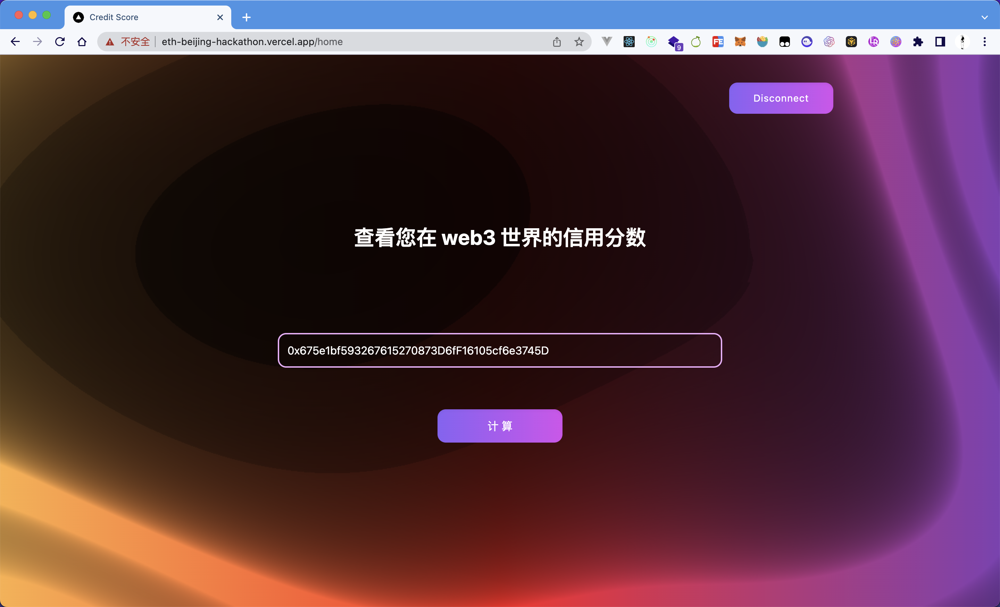
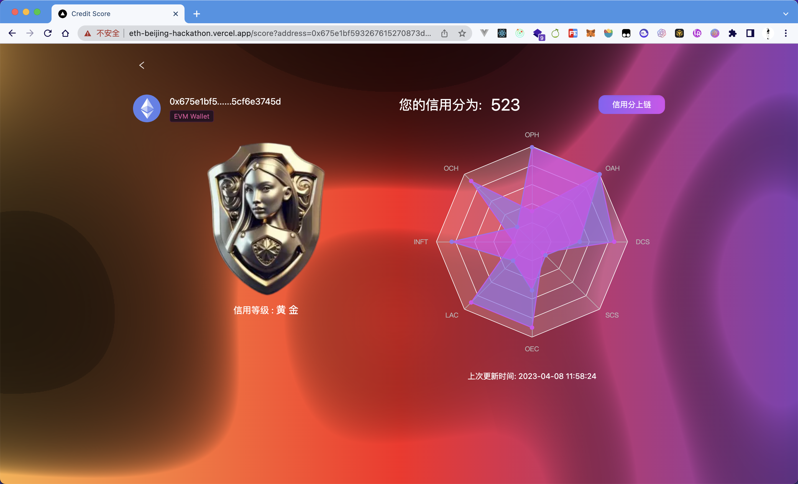
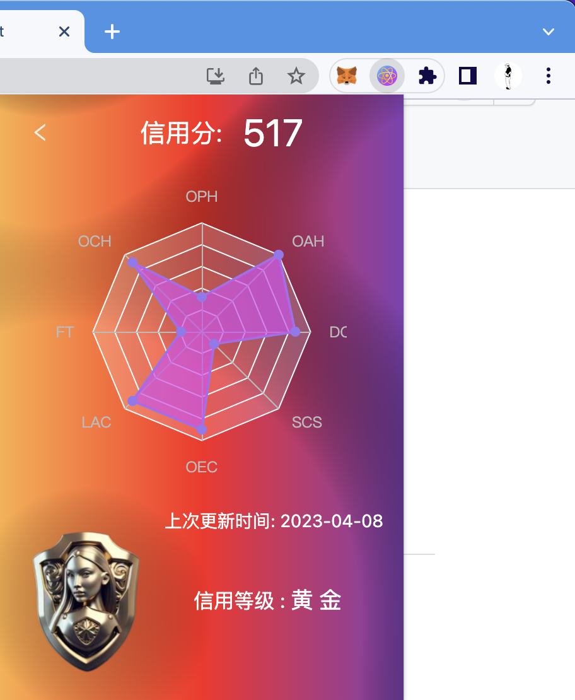
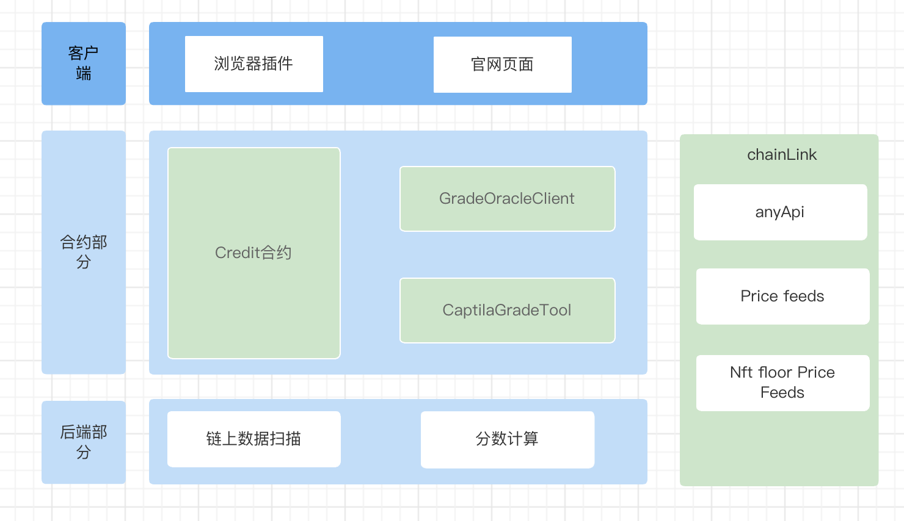
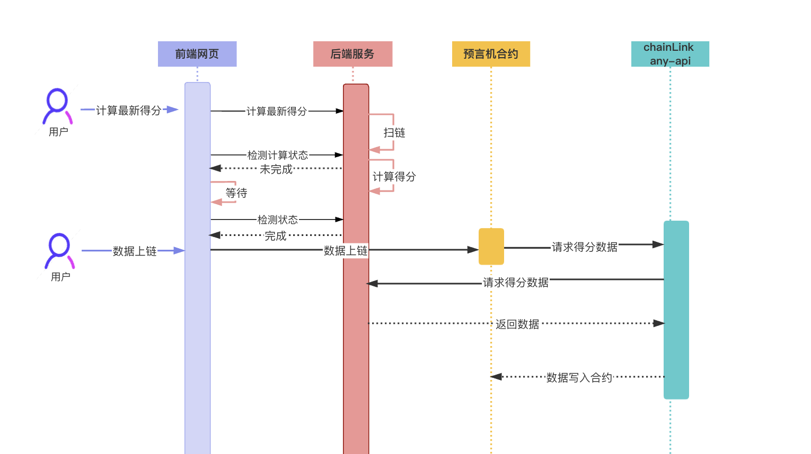
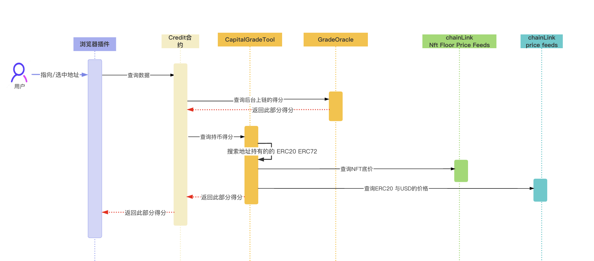

# Credit tool
在区块链的世界一切行为都是匿名的，当我们想要得知一个钱包的信息必须去到etherscan 查询
我们想做一个工具-浏览器插件，在人们选中/指向一个地址信息时，自动弹出这个地址的相关信息  

  
插件显示内容包括但不限于：头像（默认无聊猿-自动检测）用户评级  根据历史记录的行为得分， 持币情况 ，主流NFT持有情况，  甚至可以关联显示 合作方的 DID ， Aspecta-ID 等

头像： 默认自动检测无聊猿持有情况，如果有持有无聊猿自动显示
NFT展馆： 用户可提交需要显示的NFT合约，NFT必须实现了 IERC721Enumerable.tokenOfOwnerByIndex  

## [插件下载地址](https://drive.google.com/file/d/1Bk1sO78pLDfOxUI2tLIfFQRjPe7sH3j0/view)

## 项目进度
合约部分: 100%  
官网部分: 60%  头像 NFT 相关功能未完成  
浏览器插件部分: 40%  插件交互及NFT展示 方面未完成  
后端服务部分: 40%  扫链计算部分为mock数据  

# 使用指南
请使用 Sepolia 测试网
小狐狸钱包链接

## [官网](https://eth-beijing-hackathon.vercel.app/home)
1、进入[官网](https://eth-beijing-hackathon.vercel.app/home)计算账号得分 
   
2、选择是否数据上链  
  
3、更新头像（默认会检测无聊猿头像自动显示）/更新NFT持有信息   （未完成）  
4、绑定DID/Aspecta-ID （未完成）  

## 浏览器插件  
实现目标： 鼠标选中/指向地址 自动填入并查询（未完成）  
最终交互效果可参考浏览器插件 沙拉插词   

实际实现：填入地址，查询该地址链上信息
  

# Architecture diagram

# Credit Contracts
### [Credit.sol](./contracts/contracts/Credit.sol)
浏览器插件访问的合约， 头像，及其它关联信息存储在此合约  
### [CreditGradeOracleClient.sol](./contracts/contracts/CreditGradeOracleClient.sol)
 用于访问 ChainLink Any-Api 将后台获取的数据写入合约

### [CapitalGradeTool.sol](./contracts/contracts/CapitalGradeTool.sol)
 用户计算用户持币/NFT 的情况计算此部分得分

# Credit Web
1、主要用户查询用户自己的最新得分，并选择是否上链  
2、维护更新头像/nft信息   
3、维护更新第三方数据（未完成）

下图为数据上链的时序图

# Credit Browser plugin
1、查询地址已上链的得分信息  
2、显示头像/nft 等信息  （未完成）  
3、显示 第三方信息 （未完成）  

下图为浏览器查询数据的时序图

